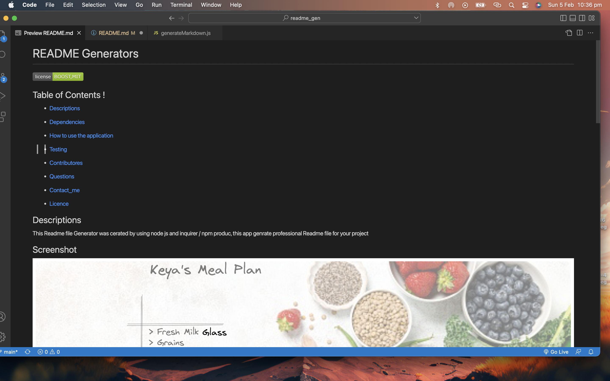

# README FILE GENERATOR

## Table of Contents !
 * [Descriptions](#description)
 * [Dependencies](#Dependencies)
 * [How to use the application](#HowToUseThisApplication)
 * [Testing](#testting)
 * [Contributores](#Contributores)
 * [Questions](#qestions)
 * [Contact_me](#contact_me)

* [Licence](#licence)

## Descriptions 
THIS README FILE GENERATOR HAS CREATED BY USING NODEJS AND NPM INQUIRER, AND IT WAS GENERATE PROFESSIONAL READ ME FILE FOR YOUR PROJECT 

## Screenshot 

## Deployed Repo URL 
https://github.com/doitnowdon/readme_gen

## Features 
THIS APP AUTOMATICALLY GENERATE README FILE FOR YOUR PROJECT 

## Dependencies
inquirer 8.2.4

## Technologies 
NODEJS NPM INQUIRER 

## Testing
N/A

## Contributores
doitnowdon

## Licence
    
     licence under BOOST,MIT license.
## Questions
Please send your queries [here](mailto:donsyntex@gmail.com?subject=[GitHub]%20Dev%20Connect) or visit [github/doitnowdon](https://github.com/doitnowdon).

